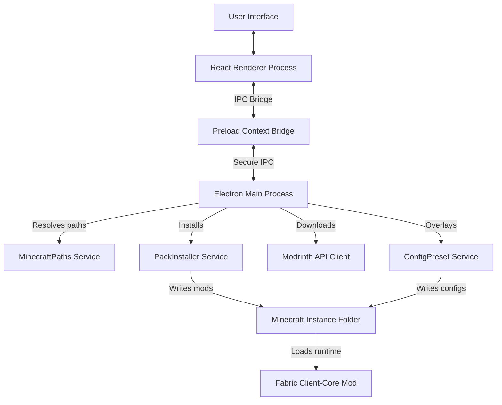
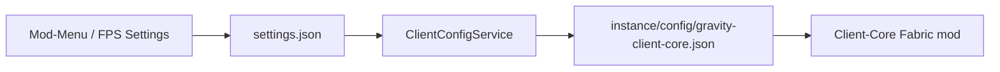

# GravityClient Architecture

This document outlines the technical architecture of the **GravityClient** ecosystem, including the desktop launcher, standard modpack format, config presets, and the Fabric client-core mod.

---

## 1. High-Level Architecture Overview

The system is designed to provide a cohesive, premium modpack loading and game launch experience. It separates launcher operations from modpack data declarations and in-game client logic.

---

## 2. Core Components

### A. The Desktop Launcher (`/launcher`)
Built on **Electron, React, TypeScript, and Vite**, the launcher avoids thick, direct backend bindings from the web view. Instead, it exposes robust service abstractions via a secure IPC preload interface.

- **Main Process Services:**
  - `MinecraftPaths`: Safely determines where Minecraft profiles, configurations, and mod directories live relative to user directories, supporting separate multi-instances.
  - `InstanceService`: Creates and manages profile metadata records (`instance.json`).
  - `ModrinthService`: Communicates with Modrinth APIs to verify project IDs, resolve optimal files matching version requirements, download assets, and verify SHA-1 and SHA-256 hashes to guarantee file integrity.
  - `PackInstaller`: An installation queue runner that downloads required core dependencies and user-selected optional mod groups.
  - `ConfigPresetService`: Replaces or overlays config presets, taking care of managed config files and automatic backup creations.
  - `FabricInstaller`: Places proper client configs and ensures loader setups are configured within launcher profiles.
  - `Nbt`: A dependency-free NBT (Named Binary Tag) codec handling gzip/zlib framing and Minecraft's modified UTF-8. Tags keep their concrete type so files can be parsed, edited and written back without discarding fields the launcher does not model.
  - `WorldService`: Reads real singleplayer worlds out of an instance's `saves/` directory by parsing each `level.dat`, and performs rename/duplicate/delete against the same files the game uses. Folder names arriving over IPC are validated so they cannot escape `saves/`.
  - `ServerService`: Reads and writes `servers.dat`, and implements Minecraft's Server List Ping protocol (handshake → status → ping/pong) to report MOTD, player counts, version, favicon and measured latency. Addresses without an explicit port are resolved through `_minecraft._tcp` SRV records.
  - `SkinService`: Maintains a local library of real skin PNGs, validating dimensions from the PNG IHDR header before anything is stored or uploaded. For signed-in Microsoft accounts it uploads to and reads from Minecraft Services.
  - `ClientConfigService`: Projects launcher settings onto the companion mod's config schema and writes `config/gravity-client-core.json` per instance.

  Services that only touch the filesystem or network take an explicit instance
  directory instead of resolving one from Electron. That keeps them runnable —
  and therefore testable — outside a live app; see `launcher/test/`.

- **Preload Context Bridge:**
  - Standardizes direct service calls. Refuses to expose powerful, arbitrary Node.js APIs (`fs`, `child_process`, `net`) to the UI, protecting the client.

- **React Renderer:**
  - Built with pure CSS variable designs (sleek, cyberpunk slate-dark design with cyan/teal accents). It displays modular progress, lets users toggles groups, and enables fast presets loading.

### B. Pack Manifest and Config Presets (`/packs`)
A declarative directory structure explaining standard modpacks.
- `/packs/standard/pack.json` is the manifest defining structural mod groupings (Performance, HUD-QoL, Utility, Minimap, Visual).
- Presets are stored as static overlay templates (e.g. `/packs/standard/presets/balanced/config/...`) containing ready-to-use in-game config structures (such as keybinds, graphic adjustments, custom client core configs).

### C. Client-Core Fabric Mod (`/client-core`)
A lightweight, modded client companion running inside the Fabric loader.
- Restricts itself to local, client-side enhancements: custom main menu hooks, an settings screen ("Client Settings"), keybind registers, and a custom config format.
- Avoids server-side interference or bypasses.
- Renders the FPS overlay described by the launcher's FPS settings screen (position, colours, background opacity, font size, rolling average) via `HudRenderCallback`. Frames are counted in the mod rather than read from a client field, so the overlay does not depend on mappings that shift between versions.
- The Client Settings screen displays the currently synced values and offers a **Reload from Launcher** action that re-reads the config file without restarting the game.

---

## 2b. Launcher → Mod Settings Handoff

The Mod-Menu and FPS settings screens are launcher UI, but the values have to
reach a running game. They travel through a file both sides agree on:

The sync runs whenever settings are saved (across every profile), after a pack
install applies a preset, and again immediately before launch. Keys the launcher
does not own — `theme`, `keybinds`, anything a preset contributed — are merged
rather than overwritten, so presets and launcher settings coexist.

---

## 3. Data Flow: Pack Installation & Overlay

When a user clicks "Install / Update" in the launcher:
1. **Validation & Resolution**: Launcher reads `pack.json` and resolved user toggles. It builds a flat array of all required mods and selected optional mods.
2. **Metadata Check**: For each mod, it queries Modrinth (or uses fallback cached URLs in `pack.json`) to find compatible file targets.
3. **Hash Verification & Download**: The downloader pipes files to `<instance_dir>/mods/`. It checks SHA-1 hashes against Modrinth metadata.
4. **Preset Application**: The selected preset files (e.g. `balanced`) are written directly to `<instance_dir>/config/`. If managed config files exist, they are archived in `config/backups/<timestamp>/` beforehand.
5. **JSON Instance Update**: A state file is written confirming successful pack sync, enabling the Launch button.
